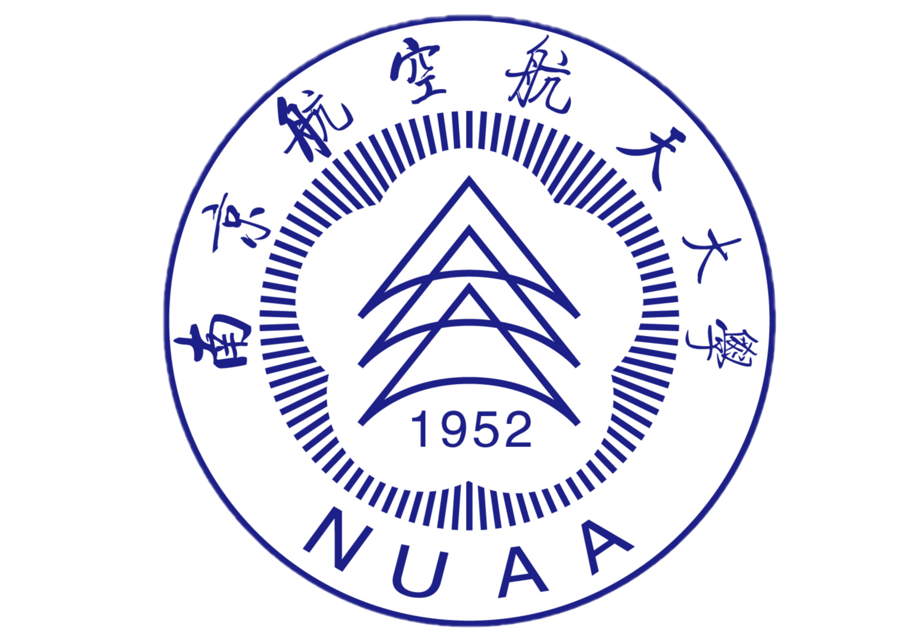

> Bo Zhao is now pursuing his PhD in School of Computer Science and Engineering, Nanyang Technological University, Singapore. He respectively received his bachelor's degree in Information Security from Nanjing University of Aeronautics and Astronautics (NUAA) in 2020, and his master's degree in Cyberspace Security from NUAA in 2023. His current research interests are mainly focused on the field of trustworthy [federated learning](https://en.wikipedia.org/wiki/Federated_learning), especially its robustness and fairness.

## Research Experiences

- **Previous**
  - Blockchain and its application, Game theory based smart contract design, Computational intensive contract, Blockchain based trustworthy distributed learning;
- **Ongoing**
  - Trustworthy federated learning.

## News

- [06/2023] I was admitted by NTU SCSE as a full-time PhD candidate.
- [01/2023] ‘FedCom’ is accepted by IEEE ICC 2023.
- [10/2022] I received the National Scholarship from MoE, PRC.
- [10/2022] Seems like my paper 'FedCom' is rejected again. Further revision is abnegated since the design is obsolete.
- [09/2022] Our paper 'FLForest' has been accepted by ICPADS 2022! Congratulations to my close peer!
- [12/2021] My paper 'FedInv' has been accepted by AAAI 2022!

## Publications

(* marks the corresponding author, *Italics* marks the supervisor)

1. **Bo Zhao**, Peng Sun*, et al., FedInv: Byzantine-Robust Federated Learning by Inversing Local Model Updates, AAAI 2022. **(CCF-A, main track oral, accept rate=5%)** [[PDF](https://ojs.aaai.org/index.php/AAAI/article/view/20903)] [[Webcite](https://aaai-2022.virtualchair.net/poster_aaai8088)]  [[Presentation](https://www.bilibili.com/video/BV1ZY4y1z74b?share_source=copy_web)]
2. **Bo Zhao**, Tao Wang, et al., FedCom: Byzantine-Robust Federated Learning Using Data Commitment, IEEE ICC 2023. **(CCF-C)**
3. **Bo Zhao**, *Liming Fang**, et al., Y-DWMS: A digital watermark management system based on smart contracts, Sensors, 2019. **(SCI, IF=3.576)** [[PDF](https://www.mdpi.com/1424-8220/19/14/3091)]
4. *Liming Fang*, **Bo Zhao**, et al., Countermeasure based on smart contracts and AI against DoS/DDoS attack in 5G circumstances, IEEE Network, 2020. **(SCI, IF=10.693)** [[PDF](https://ieeexplore.ieee.org/abstract/document/9277902)]
5. Tao Wang, **Bo Zhao**, et al., FLForest: Byzantine-robust Federated Learning through Isolated Forest, ICPADS, 2022. **(CCF-C)**

## Projects

- **Self-funding Project** (2020.01-now, host, ongoing)
  - A small experimental platform for Byzantine-robust federated learning and poisoning attacks. 
  - Integrating mainstream federated learning baselines ([FedAvg](http://proceedings.mlr.press/v54/mcmahan17a/mcmahan17a.pdf), [Multi-Krum](https://proceedings.neurips.cc/paper/2017/file/f4b9ec30ad9f68f89b29639786cb62ef-Paper.pdf), [Zeno](http://proceedings.mlr.press/v97/xie19b/xie19b.pdf), [FLTrust](https://arxiv.org/pdf/2012.13995.pdf), [FedGen](http://proceedings.mlr.press/v139/zhu21b/zhu21b.pdf), several ongoing projects, etc.), and representative poisoning attacks ([Back-gradient](https://arxiv.org/pdf/1708.08689.pdf), [Adaptive attack](https://www.usenix.org/system/files/sec20summer_fang_prepub.pdf), [Badnets](https://arxiv.org/pdf/1708.06733.pdf?ref=https://githubhelp.com), [Backdoor FL](http://proceedings.mlr.press/v108/bagdasaryan20a/bagdasaryan20a.pdf), etc.).
- **National Key R&D Program of China** (2021.12 -- 2024.11, participant, ongoing)
  - Title: "AI Security Defense and Evaluation Technology" (under Grant 2021YFB3100700, RMB \$3,000,000).
  - Student leader of federated learning security task force.
- **NUAA Undergraduate Innovation Project** (2017.12 -- 2018.05, principal participant, accomplished)
  - Title: "Blockchain based Voting System".
  - Lead to implement a PoW blockchain prototype to record voting logs and make statistics.

## Academical Services

- **PC Member**
  - FL-IJCAI'23, FL@FM-NeurIPS'23
- **Reviewer**
  - TNNLS, CIKM'23

## Awards

- National Scholarship, Ministry of Education, PRC, 2022. **(Top 3%)**
- First Class Academic Scholarship, NUAA Graduate School, 2020, 2021, 2022. **(Top 30%)**
- Special Scholarship for Freshmen, NUAA Graduate School, 2020. **(A competitive short list)**
- NUAA Outstanding Graduate, NUAA Graduate School, 2023.
- NUAA Outstanding Individual of Research & Innovation, NUAA Graduate School, 2021, 2022.
- NUAA Merit Student, NUAA Graduate School, 2022.

## Education Background

<table border="0">
<tr>
    <td align="left" valign="center" width="70%">
        
<b>2016-2020</b>

        
Nanjing University of Aeronautics and Astronautics

        
Bachelor's degree in Information Security

    </td> 
    <td align="center" valign="center">
        
    </td>
</tr>    
<tr>
    <td align="left" valign="center" width="70%">
        
<b>2020-2023</b>

        
Nanjing University of Aeronautics and Astronautics

        
Master's degree in Cyberspace Security

    </td> 
    <td align="center" valign="center">
        
    </td>
</tr>    
<tr>
    <td align="left" valign="center" width="70%">
        
<b>2023-</b>

        
Nanyang Technological University

        
Persuing PhD in School of Computer Science and Engineering

    </td> 
    <td align="center" valign="center">
        
    </td>
</tr>    
</table>

